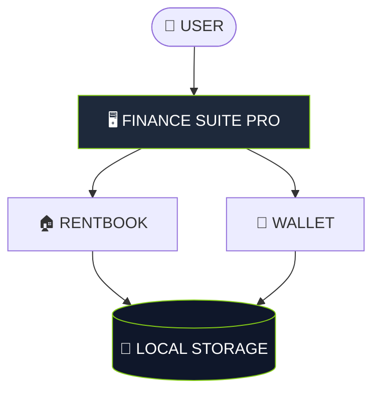

<div align="center">


<a href="https://git.io/typing-svg">
  
</a>

<br/><br/>


<br/><br/>

<a href="https://gh0stlung.github.io/FINANCE-SUITE-PRO/">
  >-84cc16?style=for-the-badge&logoColor=black&labelColor=020617"/>
</a>

<br/><br/>

<pre style="background: #0d1117; border: 2px solid #84cc16; border-radius: 8px; padding: 15px; width: 90%; color: #fff; font-family: 'Courier New', monospace;">
<span style="color: #84cc16; font-size: 18px; font-weight: bold;">💎  SINGLE FILE ARCHITECTURE  💎</span>

<span style="color: #fff;">This entire suite runs from one HTML file.</span>

No Node.js. No Database. No Internet required.
<span style="background: #84cc16; color: #000; padding: 2px 10px; border-radius: 4px; font-weight: bold;">JUST DOWNLOAD & OPEN</span>
</pre>

</div>

---

### 🔍 WHAT IS FINANCE SUITE?

> **FINANCE SUITE PRO** is a local-first personal finance OS designed for speed, clarity, and privacy.

It combines property management and expense tracking into one fluid, animated interface that runs **entirely inside your browser**.

---

### ✨ KEY MODULES

| Module | Features |
| :--- | :--- |
| **🏠 RENTBOOK** | Tenant lifecycle tracking, Auto-calculation for Rent + Electricity, Running balance ledger. |
| **👛 WALLET** | Monthly budget ring, Category-wise breakdown (Veg, Fuel, etc.), 6-month trend analytics. |
| **🎨 VISUALS** | **Cosmic Mode** (Glassmorphism) & **Knight Mode** (OLED Black). |
| **🔐 PRIVACY** | Zero-Data Collection. Your financial data never leaves your device. |

---

### 🧰 TECH STACK

<div align="center">
  
  
  
</div>

---

### ⚙️ SYSTEM ARCHITECTURE



---

### 🚀 INSTALLATION

1. **Download** the `index.html` file from this repository.
2. **Open** it in any modern browser (Chrome, Safari, Edge).
3. **(Mobile)** Tap `Share` -> `Add to Home Screen` for a full-screen app experience.

<div align="center">
<a href="https://gh0stlung.github.io/FINANCE-SUITE-PRO/">

</a>
</div>

---

### ⚠️ LIMITATIONS

* **Local Only:** If you clear your browser cache, you lose your data.
* **Backup:** You must manually save the HTML file or export data to back it up.
* **No Sync:** Data does not sync between your phone and laptop automatically.

---

<div align="center">

<p style="font-size: 12px;">FINANCE SUITE PRO V43 // DESIGNED BY TORN¬D</p>
</div>

```

```
