<div align="center">


[](https://git.io/typing-svg)


[](https://gh0stlung.github.io/FINANCE-SUITE-PRO/)

</div>

<br/>

### ⚙️ SYSTEM ARCHITECTURE

```mermaid
graph TD
    USER([👤 USER]) --> APP[🖥️ FINANCE SUITE PRO]
    APP --> RENT[🏠 RENTBOOK]
    APP --> WALL[👛 WALLET]
    RENT --> DB[(💾 LOCAL STORAGE)]
    WALL --> DB
    style APP fill:#1e293b,stroke:#84cc16,color:#fff
    style DB fill:#0f172a,stroke:#84cc16,color:#fff

```


---

### ░ SYSTEM OVERVIEW

**FINANCE SUITE PRO** is a local-first personal finance OS.

* 🚫 **No Servers**
* 🚫 **No Accounts**
* 🚫 **No Cloud Sync**

Everything runs entirely inside your browser using a **single HTML file**.

---

### ░ CORE MODULES

**🏠 RENTBOOK (Property Manager)**

* Tenant lifecycle tracking
* Auto-calculation for Rent + Electricity
* Running balance ledger (Due / Advance / Settled)

**👛 WALLET (Expense Tracker)**

* Monthly budget ring (live remaining balance)
* Category-wise breakdown (Veg, Fuel, etc.)
* 6-month trend analytics

---

### ░ VISUAL SYSTEM

**🟣 COSMIC (Default)**
Glassmorphism, Deep Gradients, Soft Glow.

**⚫ KNIGHT (OLED)**
Pure Black, High Contrast, Green Accents.

---

### ░ TECH STACK

<div align="center">

</div>

---

### ░ PRIVACY & SECURITY

* ✅ **Offline First:** Works without an internet connection.
* ✅ **Sandboxed:** Your financial data never leaves your device.
* ✅ **Portable:** To backup, simply keep the file.

---

### ░ INSTALLATION

1. **Download** the `index.html` file.
2. **Open** it in any browser (Chrome, Safari).
3. **(Mobile)** Tap `Share` -> `Add to Home Screen`.

---

<div align="center">

**FINANCE SUITE PRO V43 // DESIGNED BY TORN¬D**

</div>

```

```
