<div align="center">


<a href="https://git.io/typing-svg">
  
</a>

<p>
  
  
  
  
</p>

<a href="https://gh0stlung.github.io/FINANCE-SUITE-PRO/">
  >-84cc16?style=for-the-badge&logoColor=black&labelColor=020617"/>
</a>

</div>

<br/>

### ⚙️ SYSTEM ARCHITECTURE

```mermaid
graph TD
    subgraph CLIENT_SIDE [BROWSER ENVIRONMENT]
        style CLIENT_SIDE fill:#0f172a,stroke:#84cc16,stroke-width:2px,color:#fff
        
        USER([👤 USER]) --> APP_SHELL
        style USER fill:#84cc16,stroke:#000,stroke-width:2px,color:#000
        
        APP_SHELL[🖥️ FINANCE SUITE PRO<br/>Single HTML Runtime] --> MOD_RENT
        APP_SHELL --> MOD_WALL
        style APP_SHELL fill:#1e293b,stroke:#fff,stroke-width:1px,color:#fff
        
        subgraph MODULES [CORE MODULES]
            style MODULES fill:#020617,stroke:#334155,stroke-dasharray: 5 5
            
            MOD_RENT[🏠 RENTBOOK<br/>Tenants • Billing • Ledger]
            MOD_WALL[👛 WALLET<br/>Expenses • Budget • Charts]
            style MOD_RENT fill:#1e293b,stroke:#84cc16,stroke-width:1px,color:#fff
            style MOD_WALL fill:#1e293b,stroke:#84cc16,stroke-width:1px,color:#fff
        end
        
        MOD_RENT --> STORAGE
        MOD_WALL --> STORAGE
        
        STORAGE[(💾 LOCAL STORAGE<br/>Encrypted Browser Data)]
        style STORAGE fill:#0f172a,stroke:#84cc16,stroke-width:2px,color:#fff
    end

```


---

### ░ SYSTEM OVERVIEW

> **FINANCE SUITE PRO** is a **local-first personal finance OS** designed for speed, clarity, and privacy.

* 🚫 **No Servers**
* 🚫 **No Accounts**
* 🚫 **No Cloud Sync**

Everything runs **entirely inside your browser** using a **single HTML file**. It is the ultimate "sovereign" finance tool.

---

### ░ CORE MODULES

| Module | Features |
| --- | --- |
| **🏠 RENTBOOK**<br>

<br>*Property Manager* | • Tenant lifecycle tracking<br>

<br>• Auto-calculation for Rent + Electricity<br>

<br>• Running balance ledger (Due / Advance / Settled)<br>

<br>• Expandable payment history |
| **👛 WALLET**<br>

<br>*Expense Tracker* | • Monthly budget ring (live remaining balance)<br>

<br>• Category-wise breakdown (Veg, Fuel, etc.)<br>

<br>• Calendar-based daily spending grid<br>

<br>• 6-month trend analytics |

---

### ░ VISUAL SYSTEM

The system features two distinct "Personalities" that can be toggled instantly:

| Mode | Purpose | Aesthetic |
| --- | --- | --- |
| **🟣 COSMIC** | *Daily Driver* | Glassmorphism, Deep Gradients, Soft Glow, Animated Orbs. |
| **⚫ KNIGHT** | *Focus / OLED* | Pure Black (`#000000`), High Contrast, Green Accents. |

---

### ░ TECH STACK

<div align="center">


</div>

---

### ░ PRIVACY & SECURITY

This application follows a **Zero-Trust, Zero-Knowledge** model.

* ✅ **Offline First:** Works without an internet connection.
* ✅ **Sandboxed:** Your financial data never leaves your device.
* ✅ **No Cookies:** We do not track you.
* ✅ **Portable:** To backup, simply keep the file or export `localStorage`.

---

### ░ INSTALLATION

1. **Download** the `index.html` file from this repository.
2. **Open** it in any modern browser (Chrome, Safari, Edge).
3. **(Mobile)** Tap `Share` -> `Add to Home Screen` for a full-screen app experience.

---

<div align="center">

<p style="font-size: 12px; color: #888; margin-top: -30px;">FINANCE SUITE PRO V43 // DESIGNED BY 亗TORN乛D</p>
</div>

```

```
