<div align="center">


<a href="https://git.io/typing-svg">
  
</a>

<br/><br/>


<br/><br/>

<a href="https://gh0stlung.github.io/FINANCE-SUITE-PRO/">
  >-cce35a?style=for-the-badge&logoColor=black&labelColor=020617"/>
</a>

</div>

---

### ░ SYSTEM OVERVIEW

**FINANCE SUITE PRO (V50)** is a local-first personal finance OS designed for speed, clarity, and absolute privacy.

* 🚫 **No Servers**
* 🚫 **No Accounts**
* 🚫 **No Cloud Sync**

Everything runs entirely inside your browser using a **single HTML file**. It is the ultimate "sovereign" finance tool that works 100% offline.

---

### ░ CORE MODULES

#### 🏠 RENTBOOK (Property Manager)
* **Tenant Tracking:** Complete lifecycle management.
* **Auto-Billing:** Calculates Rent + Electricity automatically.
* **Ledger:** Running balance indicators (Due / Advance / Settled).

#### 👛 WALLET (Income & Expense)
* **🆕 Income Tracking:** Log "Added Money" sources and view net balance.
* **Smart Budget:** Visual ring chart showing live remaining balance.
* **Analytics:** Compare **Income vs. Spending** with the new Activity Trend graph.

---

### ░ VISUAL MODES

The system features two distinct personalities:

| Mode | Purpose | Aesthetic |
| :--- | :--- | :--- |
| **🟣 COSMIC** | Daily Driver | Deep Indigo, Glassmorphism, Floating Orbs. |
| **⚫ KNIGHT** | OLED / Focus | Pure Black, High Contrast, Green Accents. |

---

### ░ TECH STACK

<div align="center">


</div>

---

### ░ SYSTEM ARCHITECTURE

```mermaid
graph TD
    USER([👤 USER]) --> APP[🖥️ FINANCE SUITE V50]
    APP --> RENT[🏠 RENTBOOK]
    APP --> WALL[👛 WALLET]
    RENT --> DB[(💾 LOCAL STORAGE)]
    WALL --> DB
    style APP fill:#1e293b,stroke:#cce35a,color:#fff
    style DB fill:#0f172a,stroke:#cce35a,color:#fff

```



---

### ░ PRIVACY & SECURITY

* ✅ **Offline First:** Works perfectly without an internet connection.
* ✅ **Sandboxed:** Your financial data (`v50_` schema) never leaves your device.
* ✅ **No Cookies:** We do not track you.
* ✅ **Portable:** To backup, simply keep the HTML file or export `localStorage`.

---

### ░ INSTALLATION

1. **Download** the `index.html` file from this repository.
2. **Open** it in any modern browser (Chrome, Safari, Edge).
3. **(Mobile)** Tap `Share` -> `Add to Home Screen` for a full-screen app experience.

---

<div align="center">


<p style="font-size: 12px; color: #888;">FINANCE SUITE PRO V50 // DESIGNED BY TORN¬D</p>

</div>

```

```
